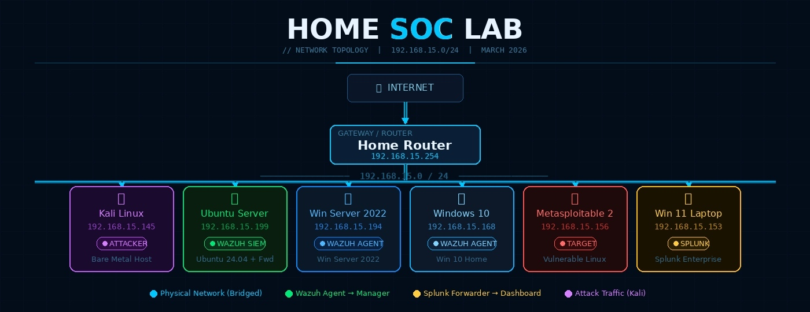
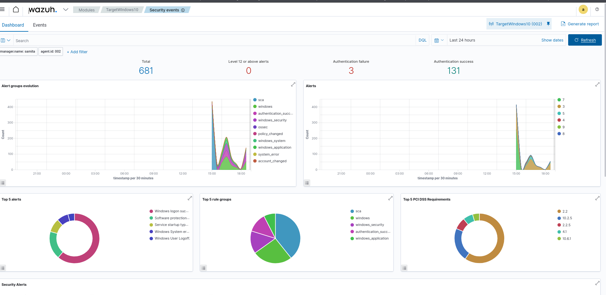
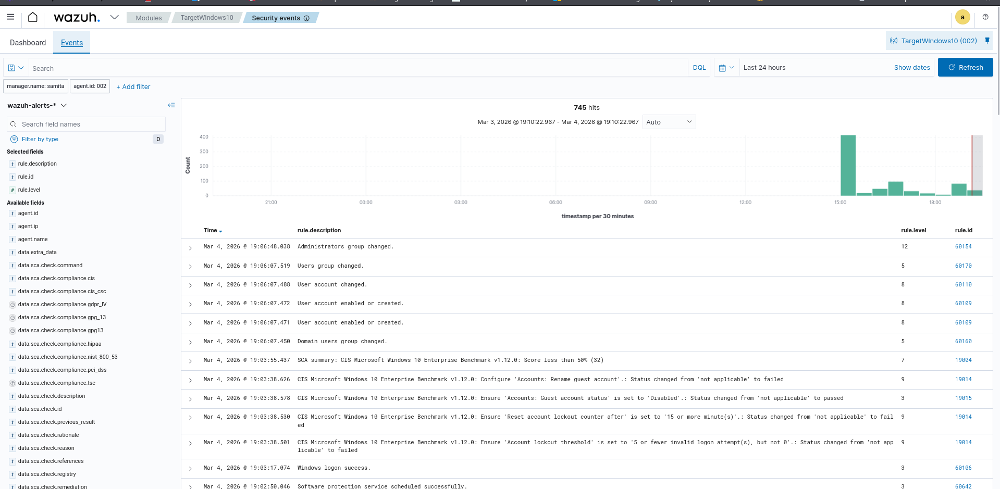
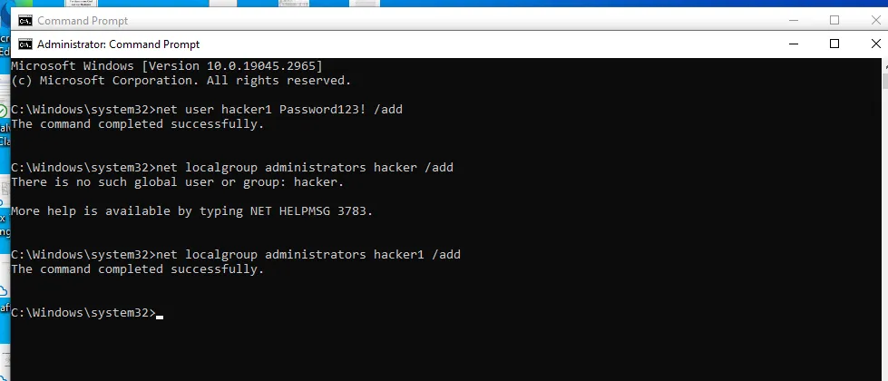

# 🛡️ Home SOC Lab — Build, Attack & Detect



> *Built from scratch on bare metal Kali Linux. Real machines. Real attacks. Real detections.*

---

## 📋 Table of Contents

- [Overview](#-overview)
- [Tools & Technologies](#-tools--technologies)
- [Network Topology](#-network-topology)
- [Lab Setup](#-lab-setup)
- [Attack Simulations](#-attack-simulations)
- [Detection Results](#-detection-results)
- [Key Learnings](#-key-learnings)
- [Future Improvements](#-future-improvements)

---

## 📌 Overview

This project documents the design, deployment, and testing of a fully functional home Security Operations Centre (SOC) lab. The lab simulates a real-world enterprise environment, enabling hands-on practice with industry-standard security monitoring, log analysis, and threat detection tools.

| Field | Details |
|---|---|
| **Lab Type** | Home SOC / Cybersecurity Home Lab |
| **Primary SIEM** | Wazuh v4.7.5 |
| **Log Analytics** | Splunk Enterprise |
| **Virtualization** | Oracle VirtualBox on Kali Linux (Bare Metal) |
| **Network** | Bridged Adapter — 192.168.15.0/24 |
| **Date Built** | March 2026 |

---

## 🧰 Tools & Technologies

| Tool | Role | Version |
|---|---|---|
| **Wazuh** | SIEM + EDR — agent-based endpoint monitoring, alerting, CIS compliance | v4.7.5 |
| **Splunk Enterprise** | Log aggregation, search, and visualization dashboard | Latest |
| **Splunk Universal Forwarder** | Streams Wazuh alerts + system logs from Ubuntu → Splunk | Latest |
| **Kali Linux** | Attacker machine — Nmap, Hydra, attack simulations | Bare Metal |
| **VirtualBox** | Hypervisor hosting all VMs on Kali bare metal | Latest |
| **Metasploitable 2** | Intentionally vulnerable Linux VM used as attack target | 2 |

---

## 🌐 Network Topology

```
                        INTERNET
                            |
                 [Home Router — 192.168.15.254]
                            |
        ──────────────── 192.168.15.0/24 ────────────────
        |           |           |          |         |          |
  [Kali .145] [Ubuntu .199] [WinSvr .194] [Win10 .168] [Meta .156] [Win11 .153]
   Attacker    Wazuh+Fwd    Wazuh Agent  Wazuh Agent   Target      Splunk
```

### Device Summary

| Device | Role | OS | IP Address |
|---|---|---|---|
| Kali Linux (Bare Metal) | Attacker / Host Machine | Kali Linux | 192.168.15.145 |
| Ubuntu Server VM | Wazuh SIEM Manager + Splunk Forwarder | Ubuntu 24.04.3 LTS | 192.168.15.199 |
| Windows Server 2022 VM | Wazuh Agent / Target | Windows Server 2022 | 192.168.15.194 |
| Windows 10 VM | Wazuh Agent / Target | Windows 10 Home | 192.168.15.168 |
| Metasploitable 2 VM | Vulnerable Attack Target | Metasploitable Linux | 192.168.15.156 |
| Windows 11 Laptop | Splunk Enterprise Dashboard | Windows 11 | 192.168.15.153 |
| Home Router | Network Gateway | — | 192.168.15.254 |

> All VMs configured with **VirtualBox Bridged Adapter** — placing every machine on the same physical subnet for direct communication.

---

## ⚙️ Lab Setup

### 1. Wazuh on Ubuntu Server

Deployed using the official all-in-one installer — sets up Wazuh Manager, Indexer (OpenSearch), and Dashboard in a single command.

```bash
curl -sO https://packages.wazuh.com/4.7/wazuh-install.sh
sudo bash wazuh-install.sh -a
```

Verify all services are running:

```bash
sudo systemctl status wazuh-manager
sudo systemctl status wazuh-indexer
sudo systemctl status wazuh-dashboard
```

Access the dashboard at `https://192.168.15.199` — credentials are printed at the end of the install.

---

### 2. Wazuh Agent Deployment

Agents deployed on Windows endpoints via the Wazuh dashboard deploy wizard (PowerShell):

```powershell
# Windows Server 2022
Invoke-WebRequest -Uri https://packages.wazuh.com/4.x/windows/wazuh-agent-4.7.5-1.msi -OutFile wazuh-agent.msi
msiexec.exe /i wazuh-agent.msi /q WAZUH_MANAGER='192.168.15.199' WAZUH_AGENT_NAME='Windows_Sever22'
NET START wazuhSvc
```

**Enrolled agents:**

| Agent ID | Name | IP | Status |
|---|---|---|---|
| 001 | Windows_Sever22 | 192.168.15.194 | ✅ Active |
| 002 | TargetWindows10 | 192.168.15.168 | ✅ Active |

> **Note:** Wazuh agent installation on Metasploitable 2 failed due to SSLv3 handshake errors caused by its legacy OpenSSL version. Metasploitable was retained as a passive attack target — consistent with real-world scenarios where not all hosts have EDR agents.

---

### 3. Splunk Universal Forwarder

Installed on Ubuntu Server to stream logs to Splunk Enterprise on the Windows 11 laptop:

```bash
# Install forwarder
sudo dpkg -i splunkforwarder.deb

# Point to Splunk instance
sudo /opt/splunkforwarder/bin/splunk add forward-server 192.168.15.153:9997

# Monitor key log sources
sudo /opt/splunkforwarder/bin/splunk add monitor /var/log/syslog
sudo /opt/splunkforwarder/bin/splunk add monitor /var/log/auth.log
sudo /opt/splunkforwarder/bin/splunk add monitor /var/ossec/logs/alerts/alerts.json

sudo /opt/splunkforwarder/bin/splunk restart
```

Configure Splunk to receive on port `9997`:
```
Settings → Forwarding and Receiving → Configure Receiving → New Port → 9997
```

**Full detection pipeline:**
```
Endpoint → Wazuh Agent → Wazuh Manager (Ubuntu) → Splunk Forwarder → Splunk Dashboard (Win11)
```

---

## 🔴 Attack Simulations

All attacks launched from **Kali Linux (192.168.15.145)** against Windows endpoints.

| # | Attack | Tool | Target | Wazuh Rule | Severity |
|---|---|---|---|---|---|
| 1 | Network Port Scan | Nmap | All VMs | 40101, 40111 | Medium |
| 2 | SMB Brute Force | Hydra | Win10 / WinServer | 5763, 5710 | High |
| 3 | Failed Login Attempts | Manual / Hydra | Windows 10 | 60122, 60204 | Medium |
| 4 | Privilege Escalation | CMD net user | Windows 10 | 60154, 60109 | **Critical** |

---

### Attack 1 — Nmap Reconnaissance

```bash
# Host discovery
nmap -sn 192.168.15.0/24

# Full service scan
nmap -sS -sV -A 192.168.15.168
nmap -sS -sV -A 192.168.15.194
```

---

### Attack 2 — Hydra SMB Brute Force

```bash
hydra -l Administrator -P /usr/share/wordlists/rockyou.txt smb://192.168.15.168 -t 4
hydra -l Administrator -P /usr/share/wordlists/rockyou.txt smb://192.168.15.194 -t 4
```

---

### Attack 3 — Failed Windows Logins

Deliberately failed logins on Windows 10 VM to trigger **Event ID 4625** detection in Wazuh.

---

### Attack 4 — Privilege Escalation

Executed on Windows 10 VM via CMD as Administrator:

```cmd
net user hacker1 Password123! /add
net localgroup administrators hacker1 /add
```

This simulates post-exploitation persistence — creating a rogue admin account. Wazuh fired a **Level 12 Critical** alert within seconds.

> Clean up after testing:
> ```cmd
> net user hacker1 /delete
> ```

---

## 📊 Detection Results

### Wazuh Alerts Fired

| Rule ID | Level | Description | Triggered By |
|---|---|---|---|
| **60154** | 🔴 **12 — Critical** | Administrators group changed | Privilege escalation |
| **60109** | 🟠 8 — High | User account enabled or created | New user creation |
| **60160** | 🟡 5 — Medium | Domain users group changed | Group membership change |
| **60122** | 🟡 5 — Medium | Windows logon failure (Event ID 4625) | Failed logins |
| **19004** | 🟡 7 — Medium | CIS Benchmark score below 50% | Compliance scan |
| **40101** | 🟡 4 — Low | Port scan detected | Nmap scan |

### Session Summary

```
Total security events (TargetWindows10):   745
Level 12+ Critical alerts:                  1
Authentication failures:                    3
Authentication successes:                 131
CIS Benchmark compliance (Win10):        <50%
```

### Screenshots

**Wazuh Security Events Dashboard**


**Level 12 Critical Alert — Administrators Group Changed**


**Privilege Escalation — CMD Execution**


---

## 🧠 Key Learnings

- Deploying and managing Wazuh all-in-one (Manager + Indexer + Dashboard) on Ubuntu Server
- Enrolling Windows agents via PowerShell and the Wazuh web deployment wizard
- Configuring Splunk Universal Forwarder to build a log forwarding pipeline
- Understanding the gap between agent-monitored hosts vs passive targets (Metasploitable SSL failure)
- Executing and documenting real attack scenarios: recon, brute force, privilege escalation
- Interpreting Wazuh rule IDs, severity levels, and Windows Event IDs (4625, 4720, 4732)
- CIS Benchmark compliance scanning and automated configuration auditing
- Debugging real-world issues: NAT vs Bridged networking, failed downloads, SSL incompatibilities

---

## 🔮 Future Improvements

- [ ] Add **pfSense** as a dedicated firewall/router with Snort/Suricata IDS
- [ ] Build custom **Splunk dashboards** for attack timeline visualization
- [ ] Map all detections to **MITRE ATT&CK** tactics and techniques
- [ ] Integrate a **threat intelligence feed** into Wazuh for IP reputation enrichment
- [ ] Enable **Wazuh Active Response** to auto-block attacking IPs
- [ ] Simulate advanced attack chains — lateral movement, data exfiltration, C2

---

## 🗂️ Repository Structure

```
home-soc-lab/
├── README.md
├── SOC_Network_Topology.jpg
├── SOC_Lab_Writeup.docx
└── screenshots/
    ├── wazuh_dashboard.png
    ├── wazuh_events.png
    ├── privesc_cmd.png
    ├── nmap_scan.png
    ├── wazuh_agents.png
    └── splunk_forwarder.png
```

---

## 👤 Author

**Samita** — Cybersecurity enthusiast building real-world skills through hands-on home labs.

---

*Built with 🔥 — not just configured, but broken, debugged, and rebuilt.*
